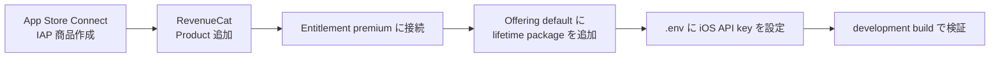

# App Store Connect / RevenueCat 画面別入力ガイド

このガイドは、`Japan Etiquette Guide` を

- 無料アプリ
- アプリ内買い切り Premium

で出すために、**どの画面で何を入れるか** をそのまま見ながら進められるようにしたものです。

## 前提

今回の売り方はこれです。

- App 本体: 無料
- 課金方式: 買い切り
- Apple の IAP 種別: `Non-Consumable`
- Product ID: `japan_etiquette_premium_lifetime`
- RevenueCat Entitlement: `premium`
- RevenueCat Offering: `default`
- RevenueCat Package: `lifetime`

全体像です。



## 1. App Store Connect

場所:
- `My Apps`
- 対象アプリ
- `Monetization`
- `In-App Purchases`

### 1-1. 新規 IAP 作成

Apple 側の作成画面で入れる値です。

| 項目 | 入れる値 |
|---|---|
| Type | `Non-Consumable` |
| Reference Name | `Japan Etiquette Guide Premium Lifetime` |
| Product ID | `japan_etiquette_premium_lifetime` |

補足:
- `Reference Name` は管理用なのでユーザーには見えません
- `Product ID` はあとで RevenueCat 側でも同じものを指定します

### 1-2. 価格設定

商品作成後に価格を設定します。

| 項目 | 入れる値 |
|---|---|
| Price | 第一候補 `¥1,480` |
| Availability | 通常は `Cleared for Sale` |

### 1-3. ローカライズ表示名

審査や表示で必要になることがあるので、最低限 `en` と `ja` は入れるのがおすすめです。

| 言語 | Display Name 候補 | Description 候補 |
|---|---|---|
| en | `Premium Lifetime` | `Unlock premium etiquette packs and deeper cultural guidance.` |
| ja | `Premium 買い切り` | `Premium パックと、より深い文化ガイドをアンロックします。` |

### 1-4. スクリーンショット

IAP 審査用に求められる場合があります。  
最初は Premium タブの画面で十分です。

おすすめ:
- Premium preview 画面
- unlocked 時の Premium packs 画面

## 2. RevenueCat

場所:
- RevenueCat Dashboard

### 2-1. Project 作成

Project 名のおすすめ:

| 項目 | 入れる値 |
|---|---|
| Project Name | `Japan Etiquette Guide` |

### 2-2. App 追加

Apple App を追加します。

| 項目 | 入れる値 |
|---|---|
| Platform | `App Store` |
| App Name | `Japan Etiquette Guide iOS` |
| Bundle ID | あなたの iOS bundle identifier |

補足:
- ここは App Store Connect のアプリと同じ bundle identifier に合わせます
- まだ bundle identifier を固定していないなら、ここで決める必要があります

### 2-3. Product 追加

RevenueCat に Apple 商品を読み込ませます。

| 項目 | 入れる値 |
|---|---|
| Store Product ID | `japan_etiquette_premium_lifetime` |
| Type | Apple 側と一致する `Non-Consumable` |

## 3. RevenueCat Entitlement

場所:
- `Entitlements`
- `+ New`

入れる値:

| 項目 | 入れる値 |
|---|---|
| Identifier | `premium` |
| Description | `Unlock premium packs and deep-dive guidance` |

その後、この Entitlement に Product を Attach します。

| 操作 | 入れる値 |
|---|---|
| Attach Product | `japan_etiquette_premium_lifetime` |

RevenueCat 公式でも、**Entitlement を作ったら Product を attach する** 流れです。  
これをしないと、買っても unlock されません。  
参考: [RevenueCat Entitlements](https://www.revenuecat.com/docs/getting-started/entitlements)

## 4. RevenueCat Offering

場所:
- `Offerings`
- `+ New`

### 4-1. Offering 作成

| 項目 | 入れる値 |
|---|---|
| Identifier | `default` |
| Description | `Default premium lifetime paywall offering` |

### 4-2. Package 作成

Offering 内で package を追加します。

| 項目 | 入れる値 |
|---|---|
| Package type | `Lifetime` |
| Description | `Premium lifetime unlock` |
| Attached product | `japan_etiquette_premium_lifetime` |

RevenueCat 公式でも、Offering には最低 1 つ package を入れ、その package に product を紐づけます。  
参考: [RevenueCat Offerings overview](https://www.revenuecat.com/docs/offerings/overview)

## 5. アプリ側 `.env`

この repo では `app.config.ts` が環境変数を読みます。

まずこれを実行します。

```powershell
cd "C:\Users\seiya\OneDrive\ドキュメント\Playground\japan-etiquette-guide"
Copy-Item .env.example .env
```

そのあと `.env` に入れる値:

```bash
EXPO_PUBLIC_REVENUECAT_IOS_API_KEY=ここにRevenueCatのiOS API key
EXPO_PUBLIC_REVENUECAT_ENTITLEMENT_ID=premium
EXPO_PUBLIC_REVENUECAT_OFFERING_ID=default
EXPO_PUBLIC_REVENUECAT_PACKAGE_TYPE=lifetime
```

どこに効くか:

- [C:\Users\seiya\OneDrive\ドキュメント\Playground\japan-etiquette-guide\app.config.ts](C:\Users\seiya\OneDrive\ドキュメント\Playground\japan-etiquette-guide\app.config.ts)
- [C:\Users\seiya\OneDrive\ドキュメント\Playground\japan-etiquette-guide\src\features\premium\lib\purchases.ts](C:\Users\seiya\OneDrive\ドキュメント\Playground\japan-etiquette-guide\src\features\premium\lib\purchases.ts)

## 6. development build

Expo Go では本課金の確認はできません。  
RevenueCat 公式も Expo では **development build が必要** としています。  
参考: [RevenueCat Expo installation guide](https://www.revenuecat.com/docs/getting-started/installation/expo)

この repo には最小 `eas.json` を追加済みです。

- [C:\Users\seiya\OneDrive\ドキュメント\Playground\japan-etiquette-guide\eas.json](C:\Users\seiya\OneDrive\ドキュメント\Playground\japan-etiquette-guide\eas.json)

実行候補:

```powershell
cd "C:\Users\seiya\OneDrive\ドキュメント\Playground\japan-etiquette-guide"
cmd /c npx.cmd eas build --profile development --platform ios
```

## 7. 完了チェック

ここまで終わったら、アプリ側ではこう見えるはずです。

| 状態 | 見え方 |
|---|---|
| API key 未設定 / Expo Go | mock billing |
| API key 設定済み / development build | live billing |
| 未購入 | `Unlock Premium` と `Restore purchases` |
| 購入済み | unlocked 状態で Premium packs が開く |

## 8. まずあなたがやること

順番はこれが一番自然です。

1. App Store Connect で `japan_etiquette_premium_lifetime` 作成
2. RevenueCat で `premium` entitlement 作成
3. RevenueCat で `default` offering + `lifetime` package 作成
4. `.env` に iOS API key を入れる
5. development build 実行

## 9. 次に私がやること

あなたが上の設定を終えたら、次は私がこれを進めるのが自然です。

1. locked シーンの CTA を本番 purchase に接続
2. Settings の `Restore Purchases` を本番接続
3. 購入成功 / キャンセル / 復元失敗の表示を polish

---

参考にした公式情報:

- [Apple: Create consumable or non-consumable In-App Purchases](https://developer.apple.com/help/app-store-connect/manage-in-app-purchases/create-consumable-or-non-consumable-in-app-purchases/)
- [Apple: In-App Purchase types](https://developer.apple.com/help/app-store-connect/reference/in-app-purchases-and-subscriptions/in-app-purchase-types)
- [RevenueCat: Entitlements](https://www.revenuecat.com/docs/getting-started/entitlements)
- [RevenueCat: Offerings overview](https://www.revenuecat.com/docs/offerings/overview)
- [RevenueCat: Expo installation guide](https://www.revenuecat.com/docs/getting-started/installation/expo)
