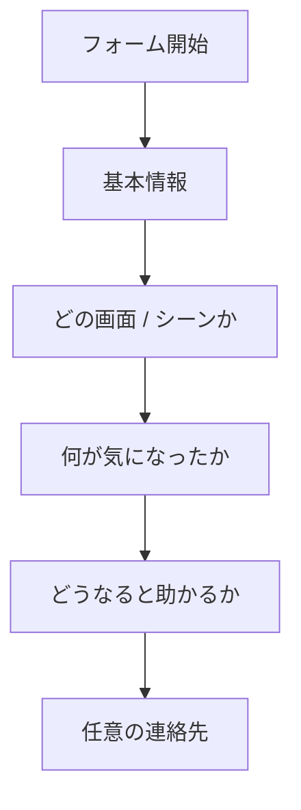

# Feedback Googleフォーム設計メモ

## 目的

`Japan Etiquette Guide` の公開初期は、最小コストで実際のフィードバックを回収したい。

そのため、最初の feedback 導線は以下で始める。

- アプリ内の `Feedback` 画面から Googleフォームを開く
- 回答は Googleフォーム + スプレッドシートで収集する
- backend や認証は入れない

## この方式を選ぶ理由

- 実装コストが最も低い
- Googleアカウント必須にしなければ回答ハードルが低い
- 回答がそのままスプレッドシートに溜まる
- fail-fast で早く公開しやすい

## 最初の運用方針

- **ログイン不要**
- **1人1回答制限は入れない**
- **ファイルアップロードは入れない**
- **まずはテキスト回答だけで回す**

理由:

- Googleログイン要求を避けたい
- 初期段階では回答数を増やす方が大事
- スクショ添付はあとで必要性が見えたら追加でよい

## フォーム全体構成



## 推奨フォームタイトル

`Japan Etiquette Guide Feedback`

### フォーム説明文のたたき台

```text
Thanks for helping improve Japan Etiquette Guide.
Short notes are completely fine.

The most helpful feedback is:
- which screen or scene you were viewing
- which language you used
- what felt unclear, awkward, or missing
- what wording or UI would have helped
```

日本語寄りにするなら:

```text
Japan Etiquette Guide の改善にご協力ありがとうございます。
短いメモでも大丈夫です。

特に助かるのは、
- どの画面やシーンを見ていたか
- どの言語を使っていたか
- 何が分かりにくかったか / 足りなかったか
- どんな文やUIだと助かったか
です。
```

## 質問項目

### 1. どの画面で気になりましたか

- 種類: `複数選択ではなく単一選択`
- 必須: `はい`

候補:

- Home
- Browse
- Search
- Category detail
- Premium
- Settings
- Feedback
- Language
- Other

### 2. どのカテゴリ / シーンを見ていましたか

- 種類: `短文回答`
- 必須: `いいえ`

補足文:

- `例: Shrine, Onsen, Ryokan, Train, Karaoke`

理由:

- Scene 名まで選択式にすると重い
- 最初は自由入力で十分

### 3. どの言語で見ていましたか

- 種類: `単一選択`
- 必須: `はい`

候補:

- English
- Japanese
- Korean
- Traditional Chinese
- Simplified Chinese
- Thai
- French
- Spanish
- Vietnamese

### 4. どんな種類のフィードバックですか

- 種類: `単一選択`
- 必須: `はい`

候補:

- Wording is unclear
- Translation feels unnatural
- A useful situation is missing
- The UI is hard to scan
- Something feels inaccurate
- Other

### 5. 何が気になりましたか

- 種類: `段落`
- 必須: `はい`

補足文:

- `短くて大丈夫です。どの表現やどの画面で引っかかったかを書いてください。`

### 6. どうなると助かりますか

- 種類: `段落`
- 必須: `いいえ`

補足文:

- `例: 最初に結論を出してほしい / もう少しやわらかい表現にしてほしい / この場面も追加してほしい`

### 7. このアプリをいつ使いましたか

- 種類: `単一選択`
- 必須: `いいえ`

候補:

- Before a trip
- During a trip in Japan
- After a trip
- Just exploring the app

この質問は初期にはなくてもよいが、あると使われ方が見えやすい。

### 8. 返信が必要ならメールアドレス

- 種類: `短文回答`
- 必須: `いいえ`

補足文:

- `任意です。必要な場合だけ入力してください。`

## 初期版で入れないもの

- ファイルアップロード
- Googleログイン必須
- 長いNPS的アンケート
- 年齢 / 国籍などの属性取得
- 10問以上の詳細アンケート

理由:

- 初期は入力負荷を低くしたい
- まずは改善に直結するメモを集めたい

## フォーム設定

Googleフォームの設定は、初期は以下を推奨。

### 回答

- メールアドレスを収集: `オフ`
- 1人1回答に制限: `オフ`
- 回答の編集を許可: `オフ`
- 回答のコピーを送信: `オフ`

### プレゼンテーション

- 進行状況バー: `オフでも可`
- 確認メッセージ: `オン`

推奨メッセージ:

```text
Thanks for sharing feedback.
We may not reply individually, but we will use these notes to improve the guide.
```

日本語版:

```text
フィードバックありがとうございます。
個別返信はできない場合がありますが、今後の改善に活用します。
```

## 回答を見返すときの列イメージ

Googleスプレッドシート上では、少なくともこの列が揃う。

- timestamp
- screen
- scene
- language
- feedback_type
- issue_body
- suggested_fix
- usage_timing
- email

## アプリ側との対応

アプリ側はすでに `EXPO_PUBLIC_FEEDBACK_FORM_URL` を読める。

そのため、フォームを作ったら次の作業だけで反映できる。

1. Googleフォームを作る
2. 公開URLをコピーする
3. `.env` に入れる

```bash
EXPO_PUBLIC_FEEDBACK_FORM_URL=https://docs.google.com/forms/d/e/xxxxxxxx/viewform
```

## 公開前の最小チェック

- iPhone で `Feedback` 画面からフォームが開く
- Googleアカウント未ログインでも回答できる
- 回答がスプレッドシートに溜まる
- 送信後メッセージが自然
- 項目数が多すぎない

## 次の発展候補

フィードバックが回り始めたら、この順で強化する。

1. スクショ共有しやすい文面を足す
2. フィードバック種別を少し整理する
3. 必要なら Apps Script 直送 or アプリ内フォームを検討する
