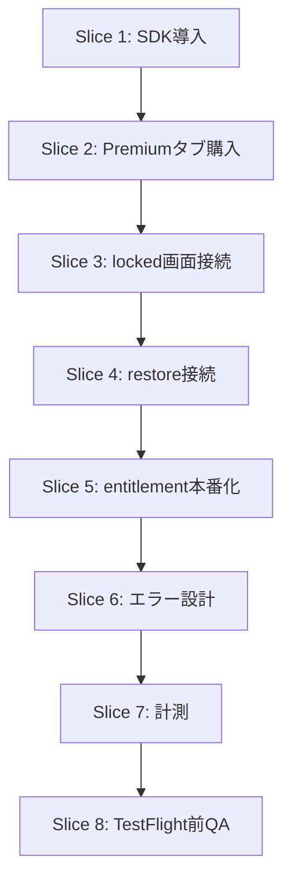

# Premium 実装タスク表

このドキュメントは、`PREMIUM_TECH_PLAN_JA.md` を実際のコード作業に落とすための
**ファイル単位の実装タスク表** です。

対象は `Japan Etiquette Guide` の iOS 向け Premium 本課金です。

## ゴール

最初の本課金で達成したい状態:

- 無料アプリとして公開
- アプリ内で買い切り Premium を購入できる
- `preview / locked / unlocked` が本物の購入状態で切り替わる
- `restore purchases` が機能する
- 初回リリース後に改善できる最低限のイベントが取れる

## Slice 1: 依存追加と RevenueCat 土台

### 目的

- RevenueCat SDK を導入する
- mock Premium state と共存できる本番用の入れ物を作る

### 更新対象ファイル

- `package.json`
- `app.json`
- `src/features/premium/store/PremiumProvider.tsx`
- `src/features/premium/hooks/usePremium.ts`
- `src/lib/storage/premium.ts`
- `src/features/premium/lib/purchases.ts` 新規
- `src/features/premium/lib/premium-errors.ts` 新規
- `.env` or Expo env 設計メモ

### やること

#### 1. 依存追加

- `react-native-purchases`
- 必要なら `expo-dev-client`

### 2. app.json 整理

- iOS bundle identifier を明示
- RevenueCat を入れる前提で EAS build に進める準備

### 3. purchases ラッパーを作る

`src/features/premium/lib/purchases.ts`

責務:

- SDK 初期化
- offerings 取得
- customer info 取得
- purchase 実行
- restore 実行

### 4. provider を本番対応に拡張

`src/features/premium/store/PremiumProvider.tsx`

今は:

- AsyncStorage ベースの mock state

次は:

- `mode: "mock" | "revenuecat"` の切替
- customer info の読み込み
- `isPremiumUnlocked`
- `isLoading`
- `purchasePremium`
- `restorePurchases`
- `refreshCustomerInfo`

### 5. storage の責務整理

`src/lib/storage/premium.ts`

今は mock entitlement を保存しているだけ。

次は:

- mock state 保存は残す
- 将来 `lastKnownEntitlement` 的なキャッシュを入れる余地は残す
- ただし本番の truth source は RevenueCat にする

## Slice 2: Premium タブを本接続

### 目的

- Premium タブの CTA が実際に購入処理を呼ぶ
- 価格も実商品から取る

### 更新対象ファイル

- `app/(tabs)/premium.tsx`
- `src/lib/i18n/marketing-copy.ts`
- `src/lib/i18n/premium-mock-copy.ts`
- `src/lib/i18n/premium-pack-copy.ts`

### やること

#### 1. Premium タブの CTA 接続

今:

- mock toggle

次:

- preview state で `purchasePremium()`
- unlocked state では売り込み CTA を出さない

#### 2. 商品表示

- RevenueCat offering から `lifetime` package を取得
- 価格表示はそこから出す
- 価格ハードコードはしない

#### 3. ローディング状態

- 商品取得中
- customer info 読み込み中
- 購入中

を区別して UI に反映

## Slice 3: locked 画面と詳細画面の本接続

### 目的

- premium-only シーンからも購入できる
- 購入後にそのまま開ける

### 更新対象ファイル

- `app/category/[slug].tsx`
- `src/components/category/CategoryHero.tsx`
- `src/lib/i18n/premium-tier-copy.ts`
- `src/lib/i18n/category-detail-copy.ts`

### やること

#### 1. locked CTA 接続

- 未購入で premium-only に来たら `purchasePremium()`

#### 2. 成功後の遷移

- 購入成功後はその場で unlocked 表示へ切り替え
- 可能なら同一画面で再レンダリング

#### 3. キャンセル / 失敗

- calm な短い文言で戻す
- 失敗時は元の locked 画面に戻る

## Slice 4: Restore Purchases

### 目的

- 再インストールや機種変更で Premium を復元できる

### 更新対象ファイル

- `app/(tabs)/settings.tsx`
- `app/(tabs)/premium.tsx`
- `src/features/premium/store/PremiumProvider.tsx`
- `src/features/premium/lib/purchases.ts`

### やること

#### 1. Settings に restore 本接続

- `Restore Purchases` を RevenueCat へ接続

#### 2. 結果ハンドリング

- 成功
- 履歴なし
- 通信失敗

を分ける

#### 3. Premium タブからも restore 可能にするか判断

- 最初は Settings のみでもよい
- ただし Premium preview からも辿れると安心感はある

## Slice 5: 本番状態の整理

### 目的

- `preview / locked / unlocked` を mock ではなく本番の購入状態で切り替える

### 更新対象ファイル

- `src/features/premium/store/PremiumProvider.tsx`
- `src/features/premium/hooks/usePremium.ts`
- `src/lib/constants/premium.ts`
- `app/(tabs)/premium.tsx`
- `app/category/[slug].tsx`

### やること

#### 1. mock toggle を開発専用に閉じる

今:

- UI から toggle 可能

次:

- 開発ビルドのみ or hidden debug only

#### 2. entitlement を truth source にする

- `customerInfo.entitlements.active["premium"]`

のみを本番 unlock 判定に使う

#### 3. 初期化中の見せ方

- entitlement 読み込み前に一瞬 locked / preview がチラつかないようにする

## Slice 6: エラー設計

### 目的

- fail-fast でも壊れて見えないようにする

### 更新対象ファイル

- `src/features/premium/lib/premium-errors.ts`
- `src/features/premium/store/PremiumProvider.tsx`
- `app/(tabs)/premium.tsx`
- `app/category/[slug].tsx`
- `app/(tabs)/settings.tsx`

### やること

- purchase cancelled
- network failure
- offerings unavailable
- restore empty
- RevenueCat init failure

を UI 用メッセージへ変換

## Slice 7: 計測

### 目的

- 初回公開後に fail-fast で改善できるようにする

### 更新対象ファイル

- `src/lib/analytics/...` 新規 or 既存計測導線
- `app/(tabs)/premium.tsx`
- `app/category/[slug].tsx`
- `app/(tabs)/settings.tsx`

### 最低限ほしいイベント

- `premium_screen_view`
- `premium_pack_open`
- `premium_cta_tap`
- `premium_purchase_start`
- `premium_purchase_success`
- `premium_purchase_cancel`
- `premium_restore_start`
- `premium_restore_success`
- `premium_locked_scene_view`

## Slice 8: TestFlight 前チェック

### 目的

- 本番前の最低 QA

### チェック項目

- iPhone 実機で purchase 成功
- restore 成功
- premium-only が未購入では閉じる
- 購入後すぐ開く
- 価格表示がストアとズレない
- `en / ja` で文言が自然

## 実装順のおすすめ

## 今すぐ着手するなら

最初の実装タスクはこれ。

1. `package.json` に RevenueCat 依存追加
2. `src/features/premium/lib/purchases.ts` 新規作成
3. `PremiumProvider.tsx` を mock + real 両対応に拡張

この 3 つで、課金実装の最初の地面ができます。

