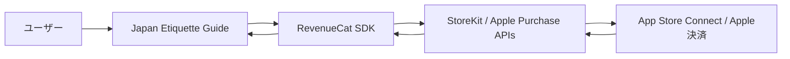
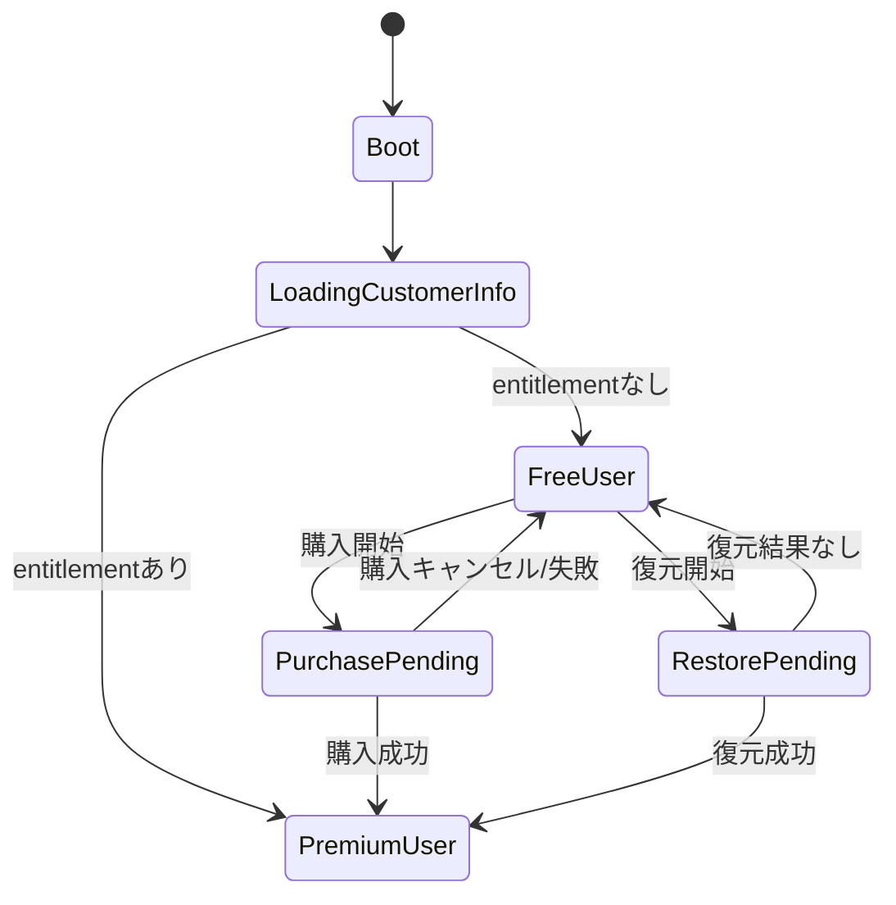

# Premium 技術設計メモ

このドキュメントは `Japan Etiquette Guide` の Premium 本課金を、

- Expo / React Native
- RevenueCat
- Apple App Store Connect

でどう実装するかを、実装前提で整理したメモです。

## 1. 結論

最初の本課金は、次の構成で進める。

- App Store 公開形態: **無料アプリ**
- 課金形態: **買い切り**
- Apple の商品種別: **Non-Consumable**
- 商品数: **1 商品**
- 課金管理: **RevenueCat**
- iOS 購入 API 実体: **StoreKit**

## 2. 全体構成



役割はこう分かれる。

- **App Store Connect**
  - 商品を作る
  - 価格や販売地域を持つ
- **StoreKit**
  - Apple の購入処理を実行する
- **RevenueCat**
  - 購入状態を entitlement として返す
  - restore を扱いやすくする
- **アプリ**
  - entitlement を見て `preview / locked / unlocked` を切り替える

## 3. 公式ベースで押さえること

Apple 公式では、買い切りの機能解放は **Non-Consumable** に当たる。  
参考:

- [Apple: In-App Purchase types](https://developer.apple.com/help/app-store-connect/reference/in-app-purchases-and-subscriptions/in-app-purchase-types)
- [Apple: Create consumable or non-consumable In-App Purchases](https://developer.apple.com/help/app-store-connect/manage-in-app-purchases/create-consumable-or-non-consumable-in-app-purchases/)

RevenueCat 公式では、Expo で本物の課金を試すには **Expo Go ではなく development build が必要**。  
参考:

- [RevenueCat: Expo installation guide](https://www.revenuecat.com/docs/getting-started/installation/expo)
- [RevenueCat: Entitlements](https://www.revenuecat.com/docs/getting-started/entitlements)
- [RevenueCat: Offerings overview](https://www.revenuecat.com/docs/offerings/overview)

## 4. 商品定義

### App Store Connect

- Reference Name: `Japan Etiquette Guide Premium Lifetime`
- Product ID: `japan_etiquette_premium_lifetime`
- Type: `Non-Consumable`

### RevenueCat

- Entitlement: `premium`
- Offering: `default`
- Package: `lifetime`
- Product mapping:
  - `japan_etiquette_premium_lifetime` -> `premium`

## 5. なぜ Offering も使うか

今回は商品が 1 つだけでも、Offering を使っておく方がよい。

理由:

- paywall 側の参照が分かりやすい
- 将来価格テストや表示差分を入れやすい
- UI と商品設定の責務が分かれる

最初はこうする。

- Offering: `default`
- Package: `lifetime`

## 6. 現在の mock 状態との対応

今のアプリにはすでに `mock premium state` がある。

今:

- `preview`
- `unlocked`

本番ではこれをこう置き換える。

### 未購入

- Premium タブ: `preview`
- premium-only シーン: `locked`
- preview シーン: 基本文 + deep dive teaser

### 購入済み

- Premium タブ: `unlocked`
- premium-only シーン: 全文表示
- preview シーン: deep dive fully unlocked

## 7. アプリ内の責務

### RevenueCat provider

新しく必要になる責務:

- SDK 初期化
- customer info の取得
- entitlement 判定
- purchase 実行
- restore 実行

理想の API はこんな形。

```ts
type PremiumState = {
  isPremium: boolean;
  isLoading: boolean;
  purchasePremium: () => Promise<void>;
  restorePurchases: () => Promise<void>;
  refreshCustomerInfo: () => Promise<void>;
};
```

## 8. 推奨ファイル構成

今の構成を大きく崩さず、こう寄せるのが自然。

```text
src/
  features/
    premium/
      hooks/
        usePremium.ts
      store/
        PremiumProvider.tsx
      lib/
        purchases.ts
        premium-errors.ts
```

補足:

- 今の mock provider は活かして差し替える
- `isMock` フラグで暫定共存させてもよい

## 9. 状態フロー



## 10. 画面ごとの実装

### Premium タブ

未購入:

- Offering から商品を取得
- 価格表示
- `Unlock Premium` CTA

購入済み:

- 今の unlocked ホームを維持
- 売り込み CTA は消す
- `restore` は控えめに残してもよい

### premium-only 詳細

未購入:

- ロック案内
- 価値説明
- 購入 CTA

購入済み:

- 通常本文 + deep dive

### Settings

- `Restore Purchases`
- 可能なら `Premium status`

## 11. 価格表示

最終価格は App Store Connect 側で設定する。  
アプリでは **固定文言で価格を埋め込まず**、できる限り RevenueCat / StoreKit から取得した表示価格を使う。

避けたいこと:

- UI に `¥1480` をハードコード
- ストア価格変更後にアプリ文言がズレる

## 12. エラー設計

最低限、次の分岐が必要。

- ユーザーが購入をキャンセル
- 通信失敗
- 商品取得失敗
- RevenueCat 初期化失敗
- restore しても購入履歴なし

ユーザー向け文言の方向:

- calm
- short
- blame しない

例:

- `Purchase was cancelled.`
- `We could not connect right now. Please try again in a moment.`
- `No previous Premium purchase was found for this Apple account.`

## 13. 開発環境と本番環境

### 開発中

- Expo Go
  - 本物の課金はできない
  - UI preview だけ

### 本物テスト

- Expo development build
- iOS sandbox tester
- TestFlight

流れ:

1. development build で purchase / restore 確認
2. TestFlight で end-to-end 確認
3. 本番公開

## 14. 実装前の環境設定

必要になるもの:

- Apple Developer Program
- App Store Connect の対象アプリ
- RevenueCat project
- iOS bundle identifier の確定
- EAS build の準備

将来的に環境変数として持つものの例:

```text
EXPO_PUBLIC_REVENUECAT_IOS_API_KEY=
```

## 15. 実装スライス

### Slice 1: 導入

- `react-native-purchases`
- `react-native-purchases-ui` を追加
- RevenueCat provider 実装
- mock state と切り替え可能にする

完了条件:

- アプリ起動
- customer info が取れる
- mock / real の切替ができる

### Slice 2: 購入

- Premium タブの CTA を purchase 接続
- locked 画面の CTA も接続
- 成功後に unlocked へ反映

完了条件:

- 開発ビルドで購入成功
- 画面反映

### Slice 3: 復元

- Settings の restore 実装
- エラー表示
- 復元後再描画

完了条件:

- 再インストール後に Premium が戻る

### Slice 4: QA / release

- TestFlight テスト
- 表示崩れチェック
- 価格表示確認
- リリース判定

## 16. fail-fast 用リリース条件

初回は、以下を満たせば出してよい。

- 購入が通る
- 復元が通る
- 購入後すぐ unlock される
- premium-only が未購入では閉じて見える
- purchased では売り込み感が消える
- `en / ja` は自然

まだ許容できること:

- pack 文言の細かい改善余地
- 一部言語の copy polish
- events 計測の軽微な追加

## 17. 観測イベント

fail-fast で改善するなら、最低限これを入れたい。

- `premium_screen_view`
- `premium_cta_tap`
- `premium_purchase_success`
- `premium_purchase_cancel`
- `premium_restore_success`
- `premium_restore_empty`
- `premium_locked_scene_view`
- `premium_pack_open`

## 18. リリース後の判断

### 良い反応

- pack 追加
- convenience 層追加
- deep dive 拡張

### 弱い反応

- 価格再検討
- paywall 文言改善
- pack の見せ方改善
- business / long-stay pack 追加

## 19. 次にやること

この設計の次にやる具体タスクはこの順。

1. RevenueCat 導入用の実装タスクをコードベース単位に分解
2. App Store Connect の IAP 商品を作成
3. Expo development build 前提の課金実装に入る

