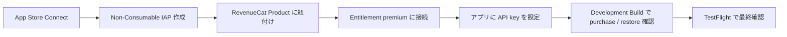
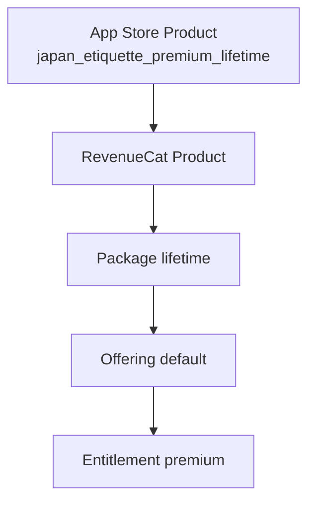

# RevenueCat セットアップメモ

このメモは `Japan Etiquette Guide` を **無料アプリ + 買い切り Premium** として出すための、
RevenueCat と App Store Connect の最小セットアップ手順です。

## 最短チェックリスト

まずはこの順で進めれば十分です。

1. App Store Connect で `Non-Consumable` 商品を 1 つ作る
2. RevenueCat で `premium` entitlement と `default` offering を作る
3. `.env` に iOS API key を入れる
4. `eas build --profile development --platform ios` で development build を作る
5. iOS sandbox tester で `purchase / restore / unlock` を確認する

## 目的

- 無料アプリとして公開する
- アプリ内で `Premium Lifetime` を 1 回だけ購入できるようにする
- 購入後は `preview / locked / unlocked` の表示を本番状態へ切り替える

## 全体像



## 1. App Store Connect

作るものは 1 商品です。

- 種別: `Non-Consumable`
- 参考名: `Japan Etiquette Guide Premium Lifetime`
- Product ID: `japan_etiquette_premium_lifetime`

### この商品で売るもの

- Premium packs
- premium-only シーン
- preview シーンの deep dive
- phrase cards / situation cards / checks

## 2. RevenueCat

RevenueCat 側では次を作ります。

- Entitlement: `premium`
- Offering: `default`
- Package: `lifetime`

紐付けイメージです。



## 3. アプリ側の環境変数

このリポジトリでは `app.config.ts` を使って Expo config を動的生成します。  
RevenueCat の iOS key は `.env` から入れる前提です。

必要な値:

```bash
EXPO_PUBLIC_REVENUECAT_IOS_API_KEY=
EXPO_PUBLIC_REVENUECAT_ENTITLEMENT_ID=premium
EXPO_PUBLIC_REVENUECAT_OFFERING_ID=default
EXPO_PUBLIC_REVENUECAT_PACKAGE_TYPE=lifetime
```

まずは `.env.example` をコピーして `.env` を作り、`EXPO_PUBLIC_REVENUECAT_IOS_API_KEY` だけ埋めれば十分です。

```powershell
Copy-Item .env.example .env
```

入れる場所:

- [C:\Users\seiya\OneDrive\ドキュメント\Playground\japan-etiquette-guide\.env.example](C:\Users\seiya\OneDrive\ドキュメント\Playground\japan-etiquette-guide\.env.example)
- [C:\Users\seiya\OneDrive\ドキュメント\Playground\japan-etiquette-guide\app.config.ts](C:\Users\seiya\OneDrive\ドキュメント\Playground\japan-etiquette-guide\app.config.ts)

## 4. 今のコードが見る場所

現在の実装はここを見ます。

- [C:\Users\seiya\OneDrive\ドキュメント\Playground\japan-etiquette-guide\app.config.ts](C:\Users\seiya\OneDrive\ドキュメント\Playground\japan-etiquette-guide\app.config.ts)
- [C:\Users\seiya\OneDrive\ドキュメント\Playground\japan-etiquette-guide\src\features\premium\lib\purchases.ts](C:\Users\seiya\OneDrive\ドキュメント\Playground\japan-etiquette-guide\src\features\premium\lib\purchases.ts)
- [C:\Users\seiya\OneDrive\ドキュメント\Playground\japan-etiquette-guide\src\features\premium\store\PremiumProvider.tsx](C:\Users\seiya\OneDrive\ドキュメント\Playground\japan-etiquette-guide\src\features\premium\store\PremiumProvider.tsx)

動きはこうです。

- Expo Go: mock のまま
- development build + API key 設定済み: RevenueCat 本番接続
- entitlement `premium` が active: unlocked
- entitlement が inactive: preview / locked

## 5. development build

本課金は Expo Go では確認できません。  
次の段階では `development build` が必要です。

このリポジトリには、development build 用の最小 `eas.json` を追加しています。

- [C:\Users\seiya\OneDrive\ドキュメント\Playground\japan-etiquette-guide\eas.json](C:\Users\seiya\OneDrive\ドキュメント\Playground\japan-etiquette-guide\eas.json)

最小方針:

1. Apple Developer / App Store Connect の準備
2. RevenueCat project 作成
3. `.env` に iOS API key を追加
4. development build 作成
5. iOS sandbox tester で purchase / restore を確認

コマンドの流れ:

```powershell
cmd /c npx.cmd expo install expo-dev-client
cmd /c npx.cmd eas build --profile development --platform ios
```

`expo-dev-client` はすでに依存に入っているので、実際には `eas build` から進めて大丈夫です。

## 6. 確認ポイント

最低限ここが通れば fail-fast で出せます。

- Premium タブで価格つき CTA が見える
- 購入が成功する
- premium-only シーンが unlocked で開く
- Restore Purchases が成功する
- 未購入状態へ戻した時に locked 表示へ戻る

## 7. まだ必要な次作業

- locked シーンの CTA を `purchasePremium()` へ本接続
- Settings に `Restore Purchases` の本接続
- development build の作成手順を README に追記
- TestFlight の実地確認
